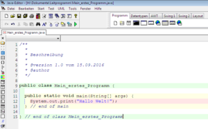

Heute habe ich das erste Kapitel unseres Leitprogramms durchgearbeitet. Zuerst wollte ich IntelliJ benutzen, als ich aber gemerkt habe dass das Leitprogramm stark auf den Java-Editor eingeht, bin ich doch noch kurzfristig umgestiegen.

Gelernt habe ich:

*   Wie ich ein einfaches "Hello World"-Programm schreibe
*   Was ein Compiler ist, was er macht und wieso man ihn braucht
    *   Er übersetzt den Quellcode (Java, C, Python etc.) in Maschinensprache (z.B. .exe), damit er vom Prozessor verstanden und ausgeführt werden kann
*   Wieso man nicht direkt in Maschinensprache programmiert
    *   Weil Maschinensprache sehr unübersichtlich und schwer zu lernen ist

Hier sieht man mein erstes Programm, welches "Hallo Welt!" ausgibt:

