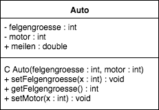
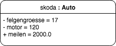

Die UML-Sprache (Unified-Modeling-Language) ist eine Reihe Richtlinien, nach denen man Objektorientierung visualisieren kann. Dabei gibt es zwei Arten von "Karten":

**Klassen-Karten**  
  
Sie stellen eine Klasse dar. Wichtig: Sie hat Ecken.  
In das oberste Feld schreibt man den Klassennamen.  
Im Feld darunter werden die Attribute gelistet:  
+ bedeutet public  
- bedeutet private

Im untersten Feld listet man die Methoden.  
C ist der Konstruktor  
+ bedeutet public  
- bedeutet private  
In die Klammern kommen noch die Parameter der Methoden.

Dabei schreibt man sowohl bei Methoden als auch bei Attributen die Datentypen dahinter, durch einen Doppelpunkt getrennt.

**Objekt-Karten**  
  
Sie stellen ein Objekt dar. Wichtig: Die Ecken sind hierbei abgerundet.  
Hier wird in der Kopfzeile der Name des Objekts angegeben, gefolgt von der Klasse, die es hat (separiert durch einen Doppelpunkt).  
Da die Methoden des Objekts ja schon in der Klassenkarte stehen, hält man hier nur die Werte der Attribute fest, wie es im Beispiel zu sehen ist.
