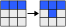
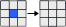

Das *Game of Life* wurde in den 1970er Jahren von John Horton Conway entworfen.
Es basiert auf einem simplen Modell des Zellzyklus und soll diesen veranschaulichen.
Das Modell wurde für einen zweidimensionalen Automaten entwickelt und lief auch auf diesem.

### Prinzip

Es gibt ein Spielfeld der Maße N*N.
Jeder Punkt dieses Spielfelds stellt eine Zelle dar, die entweder lebendig oder tot sein kann.

Fünf *Übergangsregeln* bestimmen, ob eine Zelle im nächsten Zug lebt oder stirbt:
1. **Geburt:** Eine *tote* Zelle lebt im nächsten Zug, wenn sie exakt *3* lebende Nachbarn hat: `!alive && lebendeNachbarn == 3`
2. **Tod:** Eine *tote* Zelle bleibt tot, wenn sie *nicht* exakt *3* lebende Nachbarn hat: `!alive && lebendeNachbarn != 3`
3. **Überleben:** Eine *lebende* Zelle bleibt lebend, wenn sie *2* oder *3* Nachbarn hat: `alive && (lebendeNachbarn == 2 `
`|| lebendeNachbarn == 3)`
<!--more-->
4. **Vereinsamung:** Eine *lebende* Zelle stirbt, wenn sie *weniger* als *2* lebende Nachbarn hat: `alive && lebendeNachbarn < 2`
5. **Überbevölkerung:** Eine *lebende* Zelle stirbt, wenn sie *mehr* als *3* lebende Nachbarn hat: `alive && lebendeNachbar > 3`

Als Beispiel (die jeweils mittlere Zelle wird betrachtet):







### Implementierung

Im gegebenen Raster sollten zwei Methoden vervollständigt werden.
##### anzahlLebender

```java
int anzahlLebender(int i, int j) {
  return zustand[i - 1][j - 1] + // Unten Links
          zustand[i][j - 1] + // Unten
          zustand[i + 1][j - 1] + // Unten Rechts
          zustand[i - 1][j] + // Links
          zustand[i + 1][j] + // Rechts
          zustand[i - 1][j + 1] + // Oben Links
          zustand[i][j + 1] + // Oben
          zustand[i + 1][j + 1]; // Oben Rechts
}
```
Diese Methode ermittelt für den übergebenen Punkt P(i|j) die Anzahl der Nachbarn.  
Dabei wird einfach die Summe der Zustände der Zellen um P herum zurückgegeben.  
Die Variable `zustand` ist dabei Global und enthält als 2D-Array die Zustände aller Zellen.  
Diese werden als `int` gespeichert, *0* steht für tot, *1* steht für lebend.  

Eine `ArrayIndexOutOfBoundsException` kann nicht auftreten, da diese Methode nie für einen Punkt am Rand des 2D-Arrays aufgerufen wird.

##### uebergang
```java
public Gitter uebergang(Graphics g) {
  int[][] zustandNeu = new int[N][N];

  for (int row = 1; row < N - 1; row++) {
    for (int col = 1; col < N - 1; col++) {
      final int anzahlLebende = anzahlLebender(row, col);
      final boolean alive = zustand(row, col) == 1;

      if (!alive) { // Falls schon tot
        if (anzahlLebende == 3) zustandNeu[row][col] = 1; // Falls Tot && 3 Nachbarn: Geburt
      } else if (anzahlLebende == 2 || anzahlLebende == 3) zustandNeu[row][col] = 1;  // Falls lebendig und 2-3 Nachbarn, Bleib am Leben
      else zustandNeu[row][col] = 0;  // Sonst: Tod
    }
  }

  return new Gitter(g, zustandNeu);
}
```
Sowohl `Graphics g` als auch der Rückgabetyp `Gitter` können ignoriert werden, diese sind für den Algorithmus nicht von Belang.
Diese Methode hat die Aufgabe, aus dem alten Zustand mithilfe der *Übergangsregeln* den neuen Zustand zu ermitteln.
Dafür wird ein neues, leeres Array `zustandNeu` initialisiert und nun mit den entsprechenden Werten gefüllt.
Die beiden äußeren Schleifen iterieren über `zustandNeu`.
Dann wird für jede Zelle die Anzahl der lebenden Nachbarn und der aktuelle Zustand ermittelt und in `anzahlLebende` sowie `alive` zwischengespeichert.

Falls die Zelle schon tot ist und die Anzahl der lebenden Nachbarn exakt 3 beträgt, wird die betrachtete Zelle im nächsten Zustand nach *Übergangsregel 1* leben.
Sie wird auf 1 gesetzt.

Falls die Zelle schon lebt und 2 oder 3 Nachbarn hat, darf sie nach *Übergangsregel 3* überleben.
Sie wird auf 1 gesetzt.

In jedem anderen Fall ist *Übergangsregel 2, 4* oder *5* eingetroffen, nach der die Zelle stirbt oder tot bleibt.
Sie wird auf 0 gesetzt.

### Besondere Muster

Durch diese Regeln gibt es einige besondere Muster, die sich bilden lassen.
Ein paar einfachere kann man sich hier anschauen:

(JS [Implementierung](https://github.com/nomatteus/conway-game-of-life-js) von [nomatteus](https://github.com/nomatteus))

<canvas id="life" width="100px" height="100px"></canvas>
<span>
  <select id="select">
    <option value="blinker">Blinker</option>
    <option value="tripole">Tripol</option>
    <option value="gleiter">Gleiter</option>
  </select>
  <button type="button" onclick="buttonHandler()">Start</button>
</span>
<script>
var presets = {
  blinker: [
    [0,0,0,0,0,0,0,0,0,0],
    [0,0,0,0,0,0,0,0,0,0],
    [0,0,0,0,0,0,0,0,0,0],
    [0,0,0,0,0,1,0,0,0,0],
    [0,0,0,0,0,1,0,0,0,0],
    [0,0,0,0,0,1,0,0,0,0],
    [0,0,0,0,0,0,0,0,0,0],
    [0,0,0,0,0,0,0,0,0,0],
    [0,0,0,0,0,0,0,0,0,0],
    [0,0,0,0,0,0,0,0,0,0]
  ],
  tripole: [
    [0,0,0,0,0,0,0,0,0,0],
    [0,0,0,0,0,0,0,0,0,0],
    [0,0,0,1,1,0,0,0,0,0],
    [0,0,0,1,0,1,0,0,0,0],
    [0,0,0,0,0,0,0,0,0,0],
    [0,0,0,0,0,1,0,1,0,0],
    [0,0,0,0,0,0,1,1,0,0],
    [0,0,0,0,0,0,0,0,0,0],
    [0,0,0,0,0,0,0,0,0,0],
    [0,0,0,0,0,0,0,0,0,0]
  ],
  gleiter: [
    [0,0,0,0,0,0,0,0,0,0],
    [0,0,0,0,0,0,0,0,0,0],
    [0,0,0,0,0,0,0,0,0,0],
    [0,0,0,0,1,0,0,0,0,0],
    [0,0,0,0,0,1,0,0,0,0],
    [0,0,0,1,1,1,0,0,0,0],
    [0,0,0,0,0,0,0,0,0,0],
    [0,0,0,0,0,0,0,0,0,0],
    [0,0,0,0,0,0,0,0,0,0],
    [0,0,0,0,0,0,0,0,0,0]
  ],
}
var interval
function start(preset) {
  if (interval) clearInterval(interval)
  var params = {
    canvas_id:    "life",
    cell_width:   10,
    cell_height:  10,
    init_cells:   presets[preset]
  }
  game = new GameOfLife(params);
  interval = setInterval(game.step, 100);
}
function buttonHandler() {
  var canvas = document.getElementById('life');
  var context = canvas.getContext('2d');
  context.clearRect(0, 0, canvas.width, canvas.height);
  var select = document.getElementById("select");
  var value = select.options[select.selectedIndex].value;
  start(value);
}
</script>

In diesem Video sind weitere sehr interessante, komplexe Muster und Abfolgen dargestellt:
<div class="responsive-video">
<iframe width="560" height="315" src="https://www.youtube.com/embed/C2vgICfQawE" frameborder="0" allowfullscreen></iframe>
</div>

### Quellcode
Mein Quellcode findet sich unter [https://github.com/Skn0tt/lkAlgorithmik/tree/master/GameOfLife](https://github.com/Skn0tt/lkAlgorithmik/tree/master/GameOfLife).

<script src="../assets/legacy_gs_bucket/gameoflife.js"></script>
