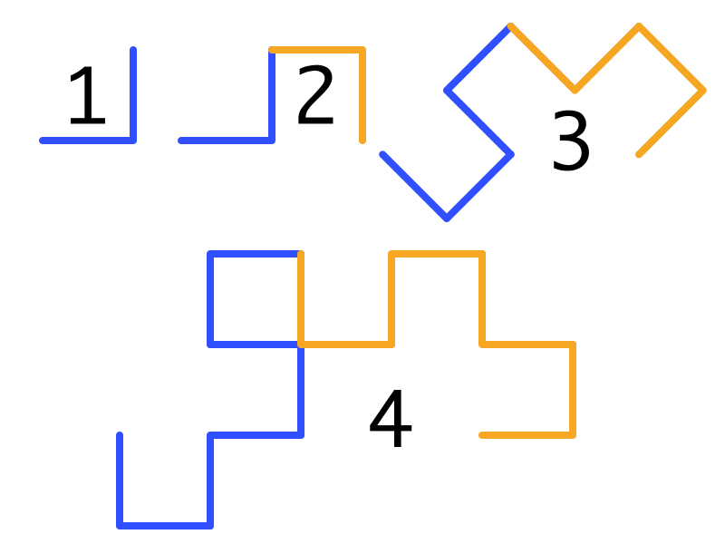

Nicht nur Zahlenfolgen lassen sich rekursiv definieren, auch mit Kurven/Figuren lässt sich das Konzept der Rekursion sehr gut veranschaulichen.

Dabei gibt es im Bereich der rekursiven Kurven einige spezielle Begriffe:
- **Initiator:** das Grundgebilde, die Rekursionsbasis
- **Generator:** der Rekursionsschritt
- **Rekursionstiefe:** Anzahl der Rekursionsebenen / die Genauigkeit der Zeichnung

> **Wichtig:** Im Generator ersetzt man *jede Strecke*, man kann nicht aus Faulheit aus einer Strecke zwei machen.  
> (Den Fehler habe ich in der Klausur gemacht 😅 )

<!--more-->

# Kochkurve
Die Koch-Kurve wurde 1904 von dem schwedischen Mathematiker [Helge von Koch](https://de.wikipedia.org/wiki/Helge_von_Koch) veröffentlicht.
Der Initiator ist eine simple Linie, der Generator ein stachelähnliches Gebilde aus vier Elementen tieferer Rekursionsebenen.


### Code
```java
void koch(int t, double laenge) {
  if (t == 1) {
    zeichneStrich(laenge);
    return;
  }

  koch(t - 1, laenge / 3);
  drehe(60);
  koch(t - 1, laenge / 3);
  drehe(2 * 60 * -1);
  koch(t - 1, laenge / 3);
  drehe(60);
  koch(t - 1, laenge / 3);
}
```

Die Kurven werden hier von einer `Turtle` gezeichnet -  mehr oder minder ein Stift, der drei Befehle kennt:
  - Bewege dich Vorwärts
  - Drehe dich
  - Hebe/Senke den Stift

Damit kann man (rasterbasierte) Bilder perfekt zeichnen.

Das eigentliche Zeichnen geschieht in Zeile 4 durch `zeichneStrich(laenge)` - wie genau dieser Befehl lautet, hängt von der genauen Implementierung der verwendeten Turtle ab.
Mit `drehe()` wird die Turtle gedreht.

Dabei dreht man einmal 60° nach links, dann 2 mal 60° nach rechts (2 \cdot 60^\circ \cdot -1), und dann wieder 60° nach links.

# Koch'sche Schneeflocke
Die Koch'sche Schneeflocke ist ein Gebilde aus 3 Kochkurven, die jeweils um 120° gedreht wurden.


# Drachenkurve
Die Drachenkurve ist ein anderes Fraktal, welches sich durch rechte Winkel und ein drachenähnliches Erscheinen auszeichnet.

Ihre Vorschrift lautet wie folgt:  
Zeichne die Drachenkurve der tieferen Rekursionsebene, drehe dich um 90 Grad und zeichne eine weitere Drachenkurve der tieferen Rekursionsebene - diese allerdings gespiegelt.



### Pseudocode
```
Initiator: zeichne Strich
Generator:
  t - 1 zeichnen
  90° links drehen
  t - 1 gespiegelt zeichnen
```

### Implementierung
```java
void drachen(int t, int vz, int laenge) {
  if (t == 0) {
    zeichneStrich(laenge);
    return;
  }

  drachen(t - 1, 1, laenge);
  drehe(90 * vz);
  drachen(t - 1, -1, laenge);
}
```
Zeile 2-5 sind der Initiator:  
Es wird ein Strich der angegebenen Länge gezeichnet.

Zeile 7-9 sind der Generator:  
Es wird der Drachen einer Rekursionsebene tiefer gezeichnet, dann wird um 90 Grad gedreht - ob links oder rechts, entscheidet `vz`.
Dann wird noch ein Drachen gezeichnet, diesmal mit negativen Vorzeichen.

Das Vorzeichen `vz` muss immer mitgegeben werden, damit die einzelnen Figuren richtig gespiegelt werden.

# Pythagoras Baum
Der Pythagoräische Baum entstammt - entgegen dem Namen - nicht der Feder Pythagoras, sondern visualisiert seinen berühmten Satz.
Ein solcher Baum besteht aus ganz vielen kleinen 'Häusern' (im Bild blau/rot) deren Dach die Grundfläche zweier weiterer Häuser bildet.


### Implementierung
```java
void pythagorasBaum(int t, int vz, double laenge) {
  if (t == 0) return; // Basis

  // 1. Seite
  turtle.forward(laenge);
  
  // 1. Haus
  turtle.left(angle * vz);
  pythagorasBaum(t - 1, vz, neueLaenge(laenge, angle));
  turtle.right(angle * vz);

  // Obere Seite
  turtle.right(90 * vz);
  turtle.forward(laenge);

  // 2. Haus
  turtle.left(angle * vz);
  pythagorasBaum(t - 1, vz * -1, neueLaenge(laenge, angle);
  turtle.right(angle * vz);

  // 2. Seite
  turtle.right(90 * vz);
  turtle.forward(laenge);

  // Untere Seite
  turtle.right(90 * vz);
  turtle.forward(laenge);

  // Zurück drehen
  turtle.right(90 * vz);
}
```

# Andere bekannte Fraktale

### Mandelbrotmenge


### Sierpinski Dreieck


### Juliamenge


# Coole Websites
Ursprünglich hatte ich vor, hier ein paar interessante Skripte einzubinden, die Fraktale erzeugen.
Da diese allerdings sehr rechenintensiv sind, habe ich mich dagegen entschieden - schau sie dir besser unter diesen Links an:

- [walsh9.github.io/topiary-demos/generator/index.html](http://walsh9.github.io/topiary-demos/generator/index.html) - Ein Baum-Generator mit viele Einstellungsmöglichkeiten
- [walsh9.github.io/topiary-demos/parallax/index.html](http://walsh9.github.io/topiary-demos/parallax/index.html) - Wald aus mehreren Fraktal-Bäumen, tolles Bild
- [walsh9.github.io/topiary-demos/animation/index.html](http://walsh9.github.io/topiary-demos/animation/index.html) - Interessante Animation eines Baumes
- [dougx.net/fractals/fractals.html](http://dougx.net/fractals/fractals.html) Mandelbrotmenge, Julia-Set und Newton-Methode
- [www.cs.utoronto.ca/~noam/fractal_machine.html](http://www.cs.utoronto.ca/~noam/fractal_machine.html) - toll gemachter Fraktal-Generator, an dem man selbst rumspielen kann. Unbedingt ausprobieren!

# Quellcode
Mein Quellcode ist einsehbar unter [github.com/Skn0tt/lkAlgorithmik/tree/master/Kochkurven](https://github.com/Skn0tt/lkAlgorithmik/tree/master/Kochkurven).
