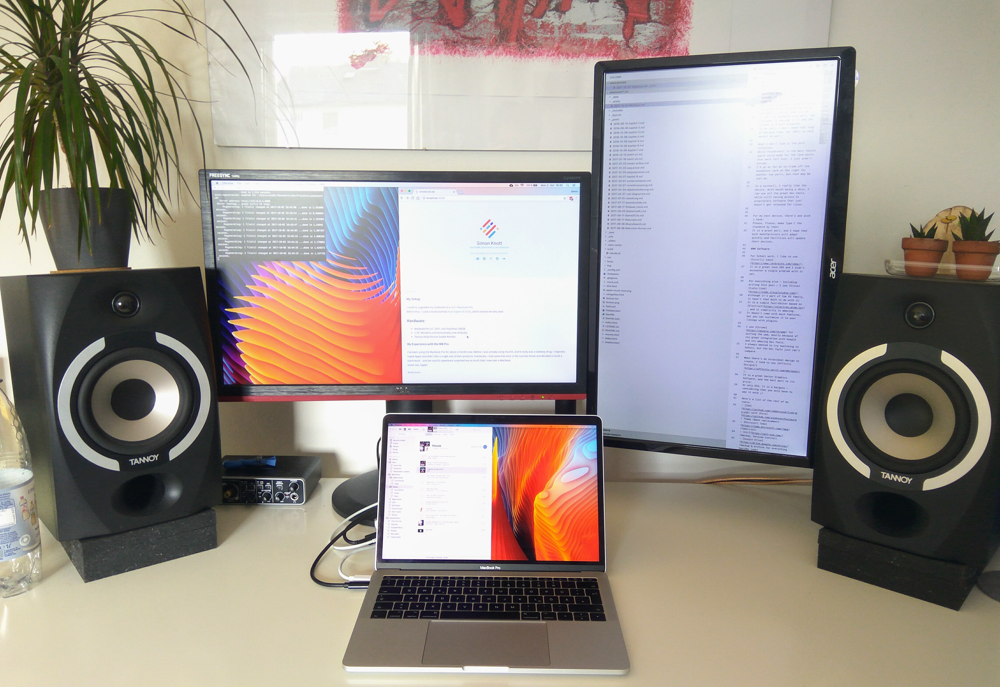

I recently upgraded my notebook to a [2017 Macbook Pro](https://www.apple.com/macbook-pro/).  
Before that, I used a Hackintosh'ed [Acer Aspire V5-573G](https://www.acer.com/ac/en/LA/content/model/NX.MCCST.001), which served me very well.

### Hardware:

- Macbook Pro 13" 2017, non-Touchbar 256GB
- 2 24" Monitors, one horizontally, one vertically
- Tannoy 601p Passive Studio Monitor

##### My Experience with the MB Pro
I've been using the Macbook Pro for about a month now.
Before, I was already using macOS, and it really was a Gateway drug.
I originally hated Apple and didn't like a single one of their products.
Eventually, I had some free time in the summer break and decided to build a hackintosh - and the macOS experience surprised me so much that I now own a MacBook.  
Good Job, Apple!

<!--more-->

I wasn't sure which MacBook to buy - while they're not very similar, they all are great Notebooks.
The first device I could cross off the list was the Macbook Air - there was no way I'd pay over €1000 to get a 1440p screen.
The decision was between the Macbook 12" and the Macbook Pro 13" -  I finally decided to get the Macbook Pro because of the "better" (haha) port selection, the more brilliant & bigger screen, and the bigger Trackpad.

To get the elefant out of the room: No, I don't *need* this notebook.
Everything I can do on it was possible before, and (by raw CPU speeds) it is only marginally faster than my old Hackintosh.
What really maskes the MB shine is the experience: Working on it is awesome, no matter what you do.
I like the keyboard very well, the Trackpad is awesome (!!!) and the screen is a bare pleasure.
To be fair, I don't need that long of battery time, but 10hrs is very decent as well.

What I don't like is the port selection.
While Thunderbolt is the best choice Apple could make for the lone ports that were left over, 2 just aren't enough.
I'd go as far as to trade off the headphone jack on the right for another two ports, but that may be just me.

In a nutshell, I really like the device. With macOS being a Unix, I can use all the great Dev tools, while still having access to proprietary Software that just doesn't get released for Linux.

For my next device, there's one wish I have:  
Please, Please, make Type C the standard by then!
It is a great port, and I hope that both manufacturers will adapt quickly and facilities will update their devices.

### Software

For School work, I like to use [IntelliJ Idea](https://www.jetbrains.com/idea/).
It is a great Java IDE and I didn't encounter a single problem with it yet.

For everything else - Including writing this post - I use [Visual Studio Code](https://code.visualstudio.com/).
Although it's part of the VS family, it hasn't that much to do with it.
It is a simple Text-Editor based on [Electron](https://electron.atom.io/), and it simplicity is amazing.
It doesn't come with much features, but you can customize it to your likings with plugins.

I use [Chrome](https://google.com/chrome) for surfing the web, mostly because of its great integration with Google and its amazing Dev Tools.
I always wanted to try switching to Safari, but the Dev Tools just can't compare.

When there's an occasional design to create, I tend to use [Affinity Designer](https://affinity.serif.com/designer/).
It is a great Vector Graphics Software, and the best part is its price:
At only €55, it is a bargain - considering that you only have to pay it once ;)

Here's a list of the rest of my tools:
- [ZSH](https://github.com/robbyrussell/oh-my-zsh) with [Pure](https://github.com/sindresorhus/pure) Theme (Bash replacement)
- [Microsoft ToDo](https://todo.microsoft.com/?app) (ToDo-List)
- [Git](https://git-scm.com/) (Backup, Version Control)
- [Google Drive](https://drive.google.com/drive/) (backup & archive for everything besides code)
- [Google Documents](https://docs.google.com) (for Collaborative Work, e.g. in school)
- [NI Traktor Pro](https://www.native-instruments.com/de/products/traktor/dj-software/traktor-pro-2/) (DJing)
- [Ableton Live](https://www.ableton.com/live/) for Music Production (occasionally)
- [iMovie](https://www.apple.com/imovie/) for Video Cut (occasionally)
