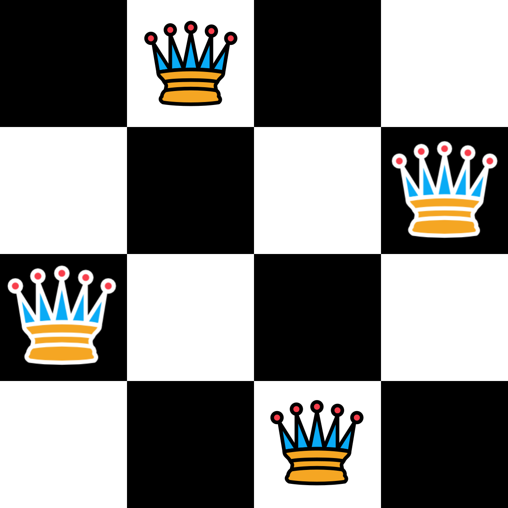

Das Damen-Problem spielt sich auf einem Schachfeld der Abmessungen N*N ab.
Wir möchten auf diesem Schachfeld N Damen so platzieren, dass keine Bedrohung vorliegt.


<!--more-->

Die Dame ist die stärkste Figur im Schach.
Sie kann sich horizontal, vertikal und diagonal beliebig bewegen.

### Lösungsansatz
Wir wissen: In jeder Zeile und jeder Spalte muss genau 1 Dame sein - sonst bedrohen sie sich gegenseitig.

Um das Problem zu lösen, eignet sich folgender Algorithmus:
Ich betrachte die erste Zeile und finde alle Möglichkeiten, an denen ich eine Dame aufstellen kann.
Ich stelle eine Dame an der ersten Möglichkeit auf.
Nun tue ich das gleiche für die nächste Zeile.
Gibt es darin keine Möglichkeiten mehr, so gehe ich eine Zeile zurück, nehme die Dame wieder weg und wiederhole den Algorithmus für die nächste Möglichkeit.

Animiert sähe dieser Algorithmus so aus:  


#### Pseudocode
```
funktion backtrack
    betrachte alle möglichkeiten in der zeile
      
    für jede möglichkeit
        setzte dame auf Möglichkeit
        führe backtrack für nächste Zeile aus
        wenn Lösung gefunden
            dann gib Lösung zurück
        nimm dame wieder weg
        
    gib keine lösung zurück
```

#### Implementierung
```java
Pos[] backtrack(int row) {
    // Ermittele alle Möglichen Standorte einer Dame in der betrachteten Zeile
    Pos[] moeglichkeiten = getMoeglichkeiten(row);

    for (Pos p : moeglichkeiten) {
      setzeDame(p);

      Pos[] loesung = backtrack(row + 1);
      if (loesung != null) return loesung; // Lösung gefunden

      entferneDame(p);
    }

    return null; // Keine Lösung gefunden
  }
```

#### Laufzeit
Ich betrachte für N Reihen N Möglichkeiten, die Laufzeit ist demnach:


O(n^2)
