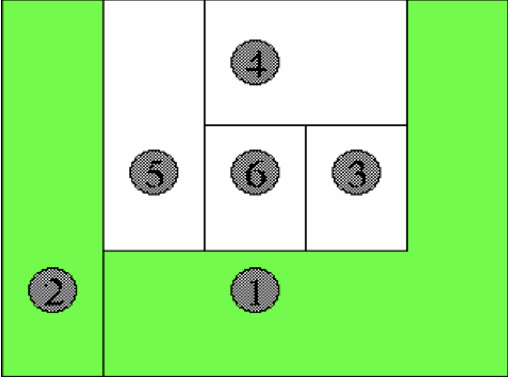
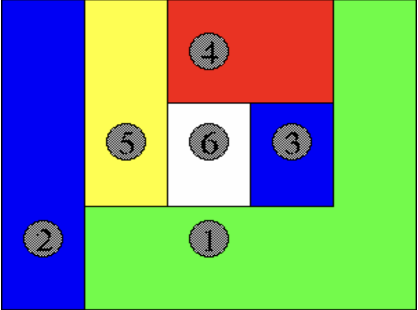

Backtracking ist eine mit der Rekursion verwandte Problemlösungsstrategie.

Beim Backtracking probiert man jede mögliche Lösung aus, überprüft allerdings mit jedem Schritt die Abbruchbedingungen des Problems.
Ist eine der Abbruchbedingungen gegeben, wird dieser "Pfad" nicht weiter verfolgt.
Dabei ist der Algorithmus immer sehr ähnlich aufgebaut:

### Pseudocode
```pseudo
backtrack()
  WENN Problem gelöst
    GIB Lösung ZURÜCK
  
  Finde Element im Ursprungszustand
  DURCHLAUFE jeden Zustand
    WENN Zustand zulässig
      Setze Zustand um

      WENN backtrack() Lösung findet
        GIB Lösung ZURÜCK
      
      Mache Zustand Rückgängig
  
  GIB keine Lösung ZURÜCK
```

<!--more-->

Für jedes Element des Problems (Spalten im Damenproblem, Länder im Vierfarbenproblem...) werden alle möglichen Zustände ausprobiert (Z. 5f).
Ist ein Zustand zulässig (Z. 7), so wird diese Möglichkeit umgesetzt (Z. 8) und rekursiv überprüft, ob es eine Lösung für den aktuellen Zustand gibt (Z. 10).
Gibt es diesen, wird er zurückgegeben (Z. 11).
Gibt es diesen nicht, wird der vorherige Schritt rückgängig gemacht (Z. 13) und der nächste Zustand überprüft.
Sollten alle möglichen Zustände überprüft worden sein, ohne dass eine Lösung gefunden wurde, dann gibt es für den aktuellen Zustand keine Lösung und das wird dementsprechend zurückgegeben (Z. 15).

Die Rekursionsbasis stellt der Fall ein, dass das Problem gelöst ist: Dann wird einfach die Lösung zurückgegeben (Z. 2f).

### Bedingungen an das Problem
Damit ein Problem effizient per Backtracking gelöst werden kann, muss es folgende Eigenschaften besitzen:

1. Das Problem ist in endlich vielen Teilschritten lösbar
2. Jeder der Teilschritte besitzt Abbruchbedingungen
3. Jeder der Schritte hat eine endliche Anzahl Lösungsmöglichkeiten

Ein Problem muss nicht zwingend eine Lösung besitzen, um effizient mit Backtracking gelöst zu werden.
Ein unlösbares Problems wird als solches erkannt.

## Am Beispiel des Vierfarbenproblems
Beim Vierfarbenproblem geht es darum, eine Karte mit n Ländern unter Verwendung von k Farben einzufärben.

Dabei müssen für jedes Feld zwei Bedingungen erfüllt sein:

> Das neu gefärbte Land grenzt an kein bereits früher gefärbtes Land mit der gleichen Farbe.



> Durch die Färbung des neuen Landes wird kein angrenzendes, noch nicht gefärbtes Land unfärbbar.



Die Bilder zeigen jeweils Fälle, in denen die Bedingungen *nicht* erfüllt sind.

Die Zweite Bedingung ist nicht zwingend notwendig, macht die Problemlösung allerdings deutlich einfacher.

### Pseudocode
Zu Demonstrationszwecken ist der folgende Code auf k = 4 Felder ausgelegt.
Wir stellen erstmal den Pseudocode für unsere beiden Bedingungen auf:

```pseudo
bedingung1(i, farbe)
  FÜR alle angrenzenden
    WENN Farbe des angrenzenden gleich farbe
      GIB false ZURÜCK
  GIB true ZURÜCK
```
Um herauszufinden, ob man eine Farbe setzen kann, überprüft man jedes der angrenzenden Länder.

```pseudo
bedingung2(i)
  ERZEUGE Liste
  FÜR alle angrenzenden
    HÄNGE Farbe AN Liste AN
  
    FALLS Liste enthält Blau UND
        Liste enthält Gelb UND
        Liste enthält Grün UND
        Liste enthält Rot
      GIB false ZURÜCK
    SONST
      GIBT true ZURÜCK
```
Wir tragen die Farbe aller umliegenden Felder in eine Liste ein.
Wenn diese Liste alle k Farben enthält (im Beispiel *Blau*, *Gelb*, *Rot* und *Grün*), ist die Bedingung nicht erfüllt.

Um nun das Problem zu lösen, benutzen wir folgenden Algorithmus:
```pseudo
vierFarbenProblem()
  FALLS alle Felder eingefärbt sind
    GIB Farben der Felder ZURÜCK

  finde das erste Land ohne Farbe
  DURCHLAUFE ALLE farben
    FALLS
      bedingung1(land, farbe) UND
      bedingung2(land)
    DANN
      SETZE farbe
      FALLS vierFarbenProblem() eine Lösung zurückgibt
        GIB die Lösung zurück
      SETZE farbe zurück
  GIB keine Lösung zurück
```
In Zeile 2f. ist die erste Rekursionsbasis: Sie überprüft, ob das Problem gelöst wurde.
Wenn es gelöst wurde, wird die Lösung zurückgegeben.

Greift die Rekursionsbasis nicht, gehen wir in den Schritt über:  
Wir finden ein Land ohne Farbe (Z. 5) und iterieren über alle Lösungsmöglichkeiten (in unserem Fall k Farben F).
Falls diese Farbe F beiden Bedingungen genügt, wird sie "ausprobiert":  
Die Farbe wird erst gesetzt (Z. 11).  
Dann wird überprüft, ob es für diese Konstellation eine Lösung gibt (Z. 12).  
Gibt es diese, wird sie zurückgegeben (Z. 13), sonst wird das Setzen der Farbe wieder rückgängig gemacht (Z. 14) und in der nächsten Iteration die nächste Farbe ausprobiert.  
Falls über alle Farben iteriert wurde, ohne eine Lösung zu finden, gibt es für diesen Zustand keine Lösung und "keine Lösung" wird zurückgegeben (Z. 15).  

### Demonstration

<link rel="stylesheet" href="https://cdnjs.cloudflare.com/ajax/libs/vis/4.21.0/vis.min.css">
<script src="https://cdnjs.cloudflare.com/ajax/libs/vis/4.21.0/vis.min.js"></script>

<style>
  .button {
    background-color: #42affa;
    display: inline-block;
    position: relative;
  }
  .demo-md-button {
    background-color: #42affa;
    padding: 0 6px 0 6px;
    margin: 6px 8px 6px 8px;
    min-width: 88px;
    height: 20px;
    border-radius: 3px;
    font-size: 14px;
    text-align: center;
    text-transform: uppercase;
    text-decoration:none;
    border: none;
    outline: none;
  }
  .demo-md-button:hover {
    background-color: #7bc7fc ;
  }
  font: {
    size: 20;
  }
</style>

<button type="button" onclick="backtrack()" class="demo-md-button">BACKTRACK</button>
<button type="button" onclick="loadPreset(1)" class="demo-md-button">Preset 1</button>
<button type="button" onclick="loadPreset(2)" class="demo-md-button">Preset 2</button>
<button type="button" onclick="loadPreset(3)" class="demo-md-button">Preset 3</button>
<div id="democontainer"/>

<script>
/**
 * Constants
 */
const RED = 'red';
const BLUE = 'blue';
const GREEN = 'green';
const YELLOW = 'orange';
const FARBLOS = 'farblos';
const FARBEN = [
  RED,
  BLUE,
  GREEN,
  YELLOW
];

/**
 * Stores the Graph
 */
let data = [];

// Presets
const preset1 = [{
    id: 0,
    edges: [1, 2],
    color: FARBLOS,
  }, {
    id: 1,
    edges: [2, 0],
    color: FARBLOS,
  }, {
    id: 2,
    edges: [0, 1],
    color: FARBLOS,
  }, {
    id: 3,
    edges: [0, 1, 2],
    color: FARBLOS,
  }
];

const preset2 = [{
  id: 0,
  edges: [1, 5, 3, 4],
  color: FARBLOS,
}, {
  id: 1,
  edges: [0, 2, 4],
  color: FARBLOS,
}, {
  id: 2,
  edges: [1, 5, 3],
  color: FARBLOS
}, {
  id: 3,
  edges: [0, 2, 5, 4],
  color: FARBLOS,
}, {
  id: 4,
  edges: [1, 0, 3],
  color: FARBLOS
}, {
  id: 5,
  edges: [2, 1, 3],
  color: FARBLOS
}]

const preset3 = [{
  id: 0,
  edges: [1, 2, 3, 4],
  color: FARBLOS,
}, {
  id: 1,
  edges: [0, 2, 3, 4],
  color: FARBLOS,
}, {
  id: 2,
  edges: [0, 1, 3, 4],
  color: FARBLOS
}, {
  id: 3,
  edges: [0, 1, 2, 4],
  color: FARBLOS,
}, {
  id: 4,
  edges: [0, 1, 2, 3],
  color: FARBLOS
}]

/**
 * Creates the Vis Data
 */
const createData = () => ({
  nodes: new vis.DataSet(
    data.map(item => ({
      id: item.id,
      label: `${item.id}`,
      color: item.color === FARBLOS ? 'lightgrey' : item.color,
    }))
  ),
  edges: new vis.DataSet(
    data.reduce(
      (arr, item) => arr.concat(
        item.edges
          .filter(edge => edge < item.id)
          .map(edge => ({
              from: item.id,
              to: edge
            })
          ),
      ),
      []
    )
  )
});

const container = document.getElementById('democontainer');
const network = new vis.Network(
  container,

  createData(),
  {}
);

/**
 * Refreshs the Data.
 */
const updateView = () => network.setData(createData());

const loadPreset = i => {
  if (i === 1) data = preset1;
  if (i === 2) data = preset2;
  if (i === 3) data = preset3;

  updateView();
}

/**
 * Implementierung
 */

/**
 * Bedingung 1
 * @param {int} i
 * @param {string} farbe
 * @returns true if met, false if not
 */
const bedingung1 = (i, farbe) => {
  const betrachtet = data[i];

  return !betrachtet.edges.some(edge => data[edge].color === farbe);
}

/**
 * Bedingung 2
 * @param {int} i
 */
const bedingung2 = (i) => {
  const arr = [];
  const betrachtet = data[i];

  betrachtet.edges.forEach(edge => arr.push(
    data[edge].color
  ));

  return !(
    arr.includes(GREEN) &&
    arr.includes(RED) &&
    arr.includes(BLUE) &&
    arr.includes(YELLOW)
  );
}

const allColored = () => data.every(item => item.color !== FARBLOS);
const getFirstUncolored = () => data.findIndex(item => item.color === FARBLOS);
const setColor = (i, color) => {
  data[i].color = color;
  updateView();
}

const backtrack = () => {
  // Basis 1: Lösung gefunden
  if (allColored()) return data;

  const betrachtet = getFirstUncolored();
  for (let color of FARBEN) {
    if (
      bedingung1(
        betrachtet,
        color
      ) &&
      bedingung2(betrachtet)
    ) {
      setColor(betrachtet, color);

      const solution = backtrack();
      if (solution !== null) return solution;

      setColor(betrachtet, FARBLOS);
    }
  }

  return null
};
</script>

In diesem Beispiel stellt jeder Knoten ein Land dar, jede Kante die gemeinsame Grenze mit einem anderen.
Mit den *Preset*-Tasten wählt man eine Voreinstellung an, mit dem *Backtrack*-Taster startet man den Algorithmus.
Bleiben die Felder Grau, ist keine Lösung möglich.

Das ganze ist mithilfe der Visualisierungs-Biblothek [Vis.js](http://visjs.org/) entstanden, die zentrale Methode sieht so aus:
```js
const backtrack = () => {
  // Basis 1: Lösung gefunden
  if (allColored()) return data;

  const betrachtet = getFirstUncolored();
  for (let color of FARBEN) {
    if (
      bedingung1(
        betrachtet,
        color
      ) &&
      bedingung2(betrachtet)
    ) {
      setColor(betrachtet, color);

      const solution = backtrack();
      if (solution !== null) return solution;

      setColor(betrachtet, FARBLOS);
    }
  }

  return null
};
```

### Präsentation
<iframe src="https://simonknott.de/slides/vierfarbenproblem.html" width="90%" height="400" frameborder="0"></iframe>

[Das Vierfarbenproblem als Präsentation](https://simonknott.de/slides/vierfarbenproblem.html)

## Am Beispiel von Sudoku
Sudoku ist ein beliebtes Zahlenrätsel, bei dem es um das ausfüllen eines Zahlenfeldes nach bestimmten Regeln geht.

Eine Matrix M der Dimension 9 \times 9 (selten andere Größen) besteht aus 3 \times 3 Submatrizen Q der Dimension 3 \times 3.
Jede Komponente sei eine natürliche Zahl 0 \geq x \geq 10, sodass x in jeder Spalte, Zeile und Submatriz einzigartig ist.

Dabei sind zu Beginn schon einige Zahlen eingetragen.


Zur Lösung eines Sudokus kann man sehr gut Backtracking verwenden.
Dabei sind die Komponenten unsere Elemente und die Zahlen [0;9] die möglichen Zustände dieser.

### Pseudocode
```pseudo
WENN Alle Komponenten befüllt
    GIB Feld ZURÜCK
  
  Finde leere Komponente
  DURCHLAUFE 1..9
    WENN Zahl zulässig
      Setze Zahl

      WENN backtrack() Lösung findet
        GIB Lösung ZURÜCK
      
      Entferne Zahl
  
  GIB keine Lösung ZURÜCK
```
