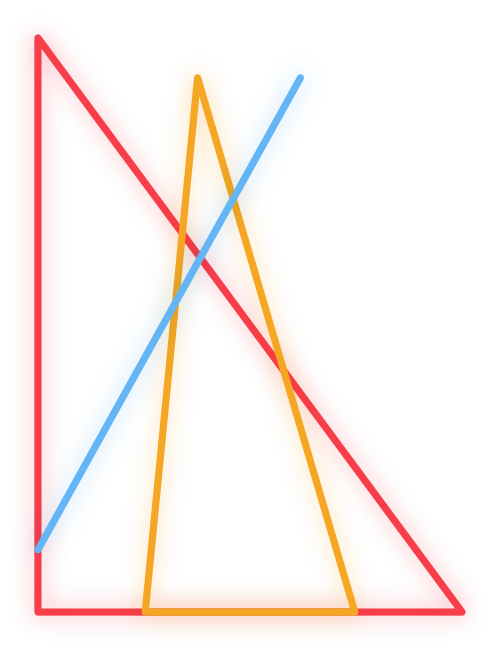
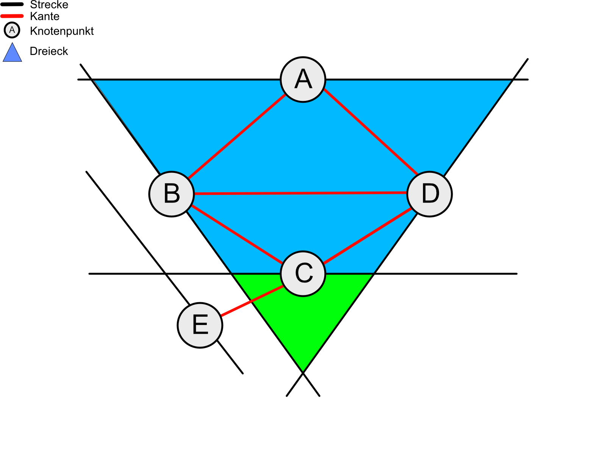

Der [Bundeswettbewerb Informatik](https://www.bwinf.de/) ist ein Jugendwettbewerb des gleichnamigen Vereins mit Sitz in Bonn.
Der BWInf stellt den Wettbewerb für die eher fortgeschrittenen Schüler dar, die durch den Informatik Biber Interesse an Informatik gewonnen haben.

Die erste Runde kann man wie jedes Jahr in Gruppen bearbeiten, ich habe Aufgabe 3 übernommen.

[Zu den Aufgaben](https://www.bwinf.de/fileadmin/user_upload/BwInf/2017/36/1._Runde/Aufgaben/BWINF_36_Aufgaben_WEB.pdf)  
Die gesamte Dokumentation kann man sich [hier](../assets/legacy_gs_bucket/Dokumentation.pdf) anschauen.  
Der Quellcode wurde [auf Github](https://github.com/Skn0tt/bwInf36A3) zur Verfügung gestellt.

## Aufgabenstellung



<!--more-->

Janina hat von ihrer Freundin Nadine ein Rätsel aus dem Internet zugeschickt bekommen:
Wie viele Dreiecke sind in dieser Zeichnung zu sehen?

Nachdem Janina eine Weile Dreiecke gezählt hat, will sie ihr Ergebnis im Internet nachprüfen.
Sie findet aber keine Lösung, sondern nur weitere Rätsel dieser Art.
Da sie sich nicht jedes Mal erneut ans Zählen machen will, überlegt sie, ob sich solche Rätsel mit einem Computer lösen lassen.

Versetze dich in Janinas Lage und schreibe ein Programm, das die Dreiecke in einer Rätsel-Zeichnung zählt.
Eine Zeichnung besteht aus einigen Strecken.
Du kannst davon ausgehen, dass keine zwei Strecken auf derselben Geraden liegen und dass sich nie mehr als zwei Strecken im gleichen Punkt schneiden. 

## Lösungsansatz
In dieser Aufgabe lässt sich ein Dreieck wie folgt definieren:

> Drei Strecken, die einander schneiden.

Dies machen wir uns zunutze:
Wir tragen alle Strecken in einen gerichteten Graphen auf, in dem

- jede Strecke durch einen Knotenpunkt dargestellt wird
- jeder Knotenpunkt mit den Knoten verbunden ist, dessen Strecke sich mit seiner schneidet

Nun kann man die oben genannte Eigenschaft des Dreiecks nutzen:
Findet man in diesem Graphen einen Weg, durch bewegen an drei Kanten wieder zum Ausgangsknoten zu kommen, hat man ein Dreieck gefunden.

An der Skizze wird das ein wenig deutlicher.



<!--more-->

Folgende Wege sind möglich:


graph LR
A --> B
B --> D
D --> A


graph LR
B --> C
C --> D
D --> B


Dementsprechend sind in der Skizze zwei Dreiecke versteckt.

Der Lösungsansatz sieht also wie folgt aus:

- Stelle den Graphen auf
- Finde im Graphen alle Möglichkeiten, in 3 Schritten wieder den Ausgangsknoten zu erreichen

### Architektur der Lösung
Der Code besteht aus folgenden drei Teilen:

- Input
  - Nimmt die Nutzereingaben entgegen
  - Klasen:
    - InputSwing
      - Simple Swing-GUI
    - InputReader
      - Parser, um aus den Eingaben `Line2D`-Objekte zu erzeugen
- Berechnung
  - Eigentlicher Algorithmus, berechnet die Dreiecke
  - Klassen:
    - Graph
      - Modelliert den Graphen
      - Kümmert sich um die Suche der Dreieecke
    - Triangle
      - Modelliert ein Dreieck
    - Geometry
      - enthält die Methoden zur Berechnung eines Schnittpunkts (Vektorrechnung)
- Output
  - Zeigt die gefundenen Dreiecke/Strecken der Eingabe an
  - OutputSwing
    - Zeigt Output in einem Swing-Fenster an
  - OutputWeb
    - Zeigt Output mithilfe `JSXGraph` in einem Browserfenster an

### Modellierung des Graphen
Im Graphen wird jeder Knotenpunkt durch ein Objekt der Klasse `Node` modelliert.
In diesem ist die eigene Strecke als `Line2D`-Objekt sowie Knotenpunkte, die mit ihm verbunden sind, in einer `ArrayList` gespeichert.

> Du kannst davon ausgehen, dass keine zwei Strecken auf derselben Geraden liegen [...]

Aus der Aufgabenstellung geht hervor, dass es keine identischen Strecken gibt.
Damit die gleiche Strecke nicht mehrmals im Graphen vorliegt, sind alle Knotenpunkte in einer `Map` gespeichert, in der sie durch einen Hash (bestehend aus ihren Koordinaten) eindeutig identifiziert werden.
Wird nun die gleiche Strecke zweimal hinzugefügt, so wird die Alte  überschrieben.

Die Erstellung des Graphen funktioniert wiefolgt:
Zuerst werden alle Knotenpunkte hinzugefügt.
Dann wird jeder Knoten mit jedem anderen verglichen (O(n^2)) und - falls nach der oben beschriebenen Methode eine Überschneidung besteht - eine Verbindung hergestellt (indem sie zur Liste der Schneidenden hinzugefügt wird).


### Durchsuchen des Graphen nach Dreiecken
Um im Graphen nun Dreiecke zu finden, durchsuche ich alle Knoten nach der Möglichkeit, mit drei Schritten an den Kanten zurück zum Ausgangsknoten zu kommen:

```java
for (Node a : nodes) {  // Ausgansknoten
  for (Node b : a.intersects) { // Schritt 1
  if (a == b) continue;

    for (Node c : b.intersects) { // Schritt 2
    if (a == c) continue;
    if (b == c) continue;

      for (Node d : c.intersects) { // Schritt 3
        if (a == d) { // Überprüfung, ob Ausgangsknoten
          // Dreieck gefunden
        }
      }
    }
  }
}
```
`.intersects` gibt die Knotenpunkte zurück, mit denen ein Knoten verbunden ist.

Innerhalb dieser Schleifen überspringe ich mit `continue` die Durchläufe, die schon unter 3 Schritten wieder beim Ausgangsknoten sind oder sich an den Kanten zurück bewegen.

### User Interface
#### Input
Für die Nutzereingabe habe ich eine kleine Swing-GUI geschrieben.
Diese bietet die Möglichkeit

- per Copy & Paste Eingaben einzufügen
- eine der Test-Eingaben auszuwählen
- Eine Linie durch Eingabefelder hinzuzufügen

#### Output
Die Ergebnisse der Dreiecksfindung wird als Text-Ausgabe im unteren Fenster angezeigt.
Zusätzlich kann man sich In-/Output graphisch anzeigen lassen, den Input nur im Browser, den Output im Browser und in einer Swing-Zeichnung.

#### Anzeige im Browser
Die Swing-Zeichnung ist zwar ganz schön, um sich die Dreiecke grob anzuschauen - man kann aber keine Koordinaten erkennen.

Dafür habe ich eine kleine Website erstellt, die die Bibliothek [JSXGraph](https://jsxgraph.uni-bayreuth.de) der Universität Bayreuth nutzt.

Diese besteht aus einem Template, in dem ich mit einer RegEx meine anzuzeigenden Objekte in `JSON`-Format einfüge.

```java
text.replaceAll("##POLYGON##", json);
```

Die JSON-Daten könnten in etwa so aussehen:

```json
[
  [[0.0, 0.0], [0.0, 200.0], [120.0, 0.0]],
  [[0.0, 20.0], [0.0, 200.0], [55.10204082, 108.16326531]],
  [[20.0, 0.0], [41.73913043, 130.43478261], [120.0, 0.0]],
  [[20.0, 0.0], [50.0, 180.0], [100.0, 0.0]],
  [[82.75862069, 62.06896552], [100.0, 0.0], [120.0, 0.0]]
];
```

Eckige Klammern markieren ein Array, wir haben hier also fünf Arrays bestehend aus jeweils drei Arrays mit jeweils einem Wertepaar bzw. Punkt.

Diese Werte werden dann von der Website mit einem kurzen Script zum `Board`, also zur Anzeigetafel, hinzugefügt.
