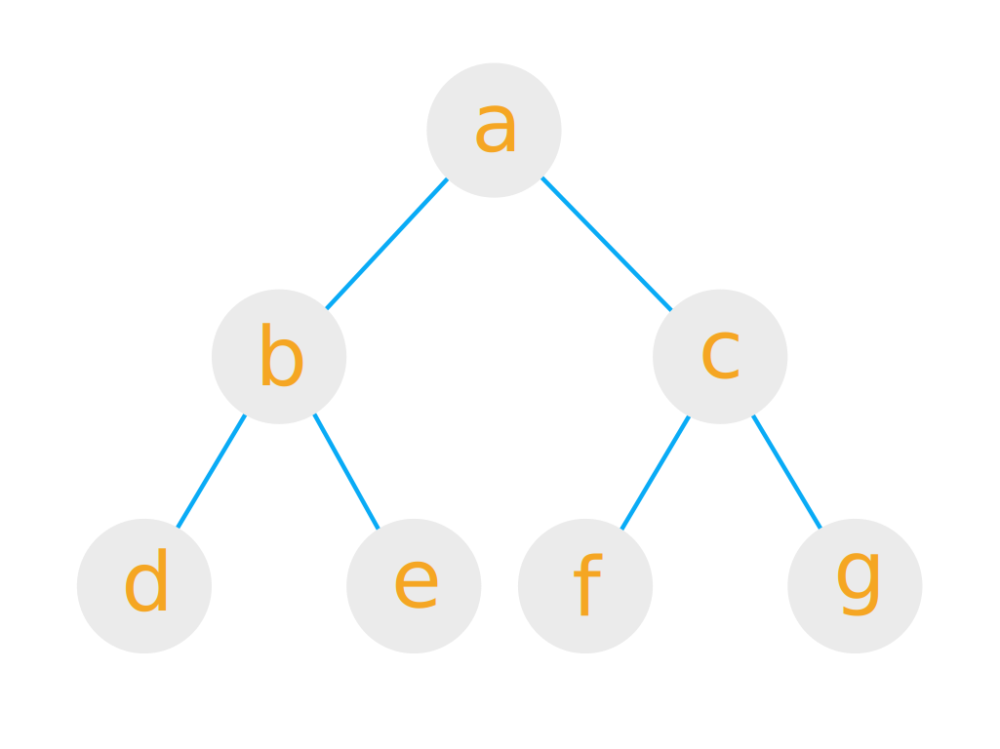
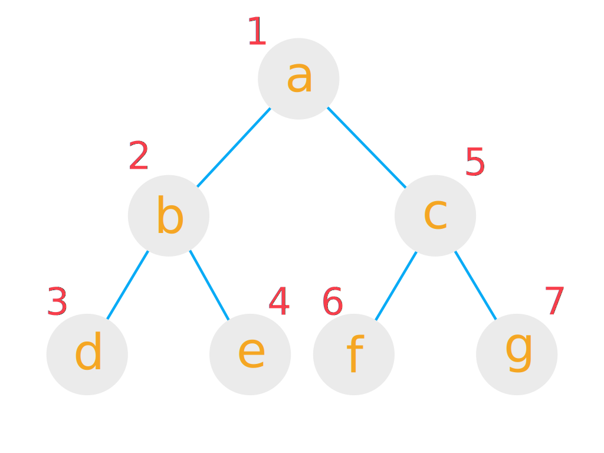
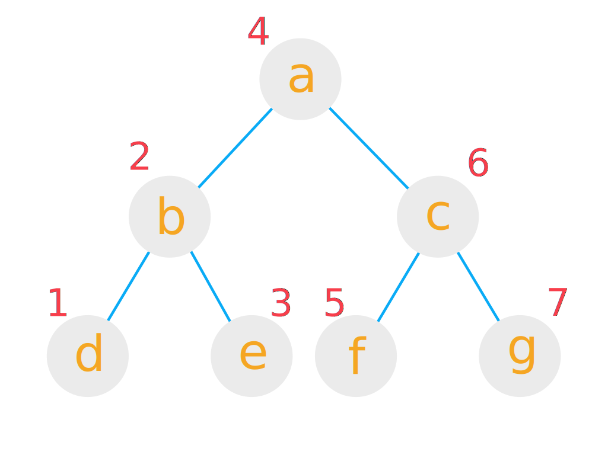
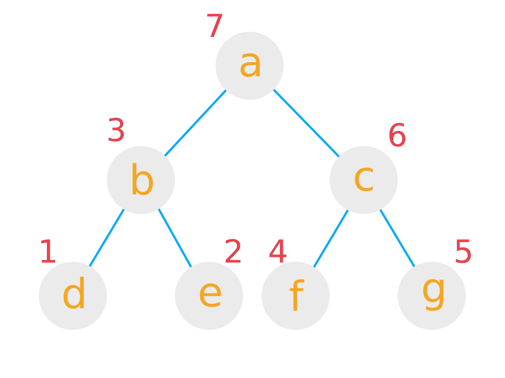

Der Binärbaum ist eine nicht lineare Datenstruktur.
Er ist eine Unterform des Baumes und somit auch des gerichteten Graphen.
Zu Beginn sollten einige grundlegende Begriffe des Baumes geklärt werden.



<!--more-->

## Grundbegriffe Baum

**Knoten:** Ein Wert im Baum. Im Beispiel: `a`, `b`...

**Kante:** Eine Verbindung zwischen zwei Knoten. In der Zeichnung durch einen verbindenden Strich dargestellt.

**Vorgänger:** Knoten, über den man zu diesem Knoten gelangt ist. Im Beispiel: `b` ist der Vorgänger von `d`.

**Wurzel:** Der erste Knoten. Der einzige Knoten ohne Vorgänger. Im Beispiel: `a`.

**Blatt:** Knoten ohne Kinder. Im Beispiel: `d`, `e`, `f`, `g`.

**Grad:** Anzahl der Kinder eines Knoten. Im Beispiel: Knoten `b` hat den Grad 2.

**Pfad:** Weg, um zu einem Knoten zu gelangen. Im Beispiel: `LR` beschreibt den Pfad, um zu Knoten `e` zu gelangen.

**Ebene:** Alle Knoten, die nach n Schritten erreichbar sind. Im Beispiel: `b` und `c` gehören Ebene 1 an.

**Tiefe:** Länge des längstmöglichen Pfads. Im Beispiel: 2.

**Teilbaum:** Jeder Knoten kann als neue Wurzel betrachtet werden. Hier entspringt ein neuer Teilbaum. Im Beispiel: `b` und `c` sind Wurzeln der Teilbäume von `a`.

## Kriterien Binärbaum
Ein Binärbaum muss zwei Kriterien erfüllen:

Er ist *azyklisch*, das heißt in ihm gibt es keine Möglichkeit, beim traviersieren in einen Kreislauf zu geraten.

Der Grad eines jeden Knoten muss \leq 2 sein.

## Implementierung
Die Implementierung des BinaryTree ist sehr simpel.

```java
class BinaryTree<ContentType> {
  /**
   * Attributes
   */
  ContentType content;
  BinaryTree<ContentType> leftTree;
  BinaryTree<ContentType> rightTree;

  /**
   * Constructors
   */

  // Erstellt leeren Baum
  BinaryTree() {}

  // Erstellt Blatt
  BinaryTree(ContentType content) {
    if (content == null) { return; }

    this.content = content;

    this.leftTree = new BinaryTree<>();
    this.rightTree = new BinaryTree<>();
  }

  // Erstellt Inneren Knoten
  BinaryTree(ContentType content, BinaryTree<ContentType> leftTree, BinaryTree<ContentType> rightTree) {
    if (content == null) { return; }

    this.content = content;

    if (leftTree == null) { this.leftTree = new BinaryTree<>(); }
    else { this.leftTree = leftTree; }

    if (rightTree == null) { this.rightTree= new BinaryTree<>(); }
    else { this.rightTree = rightTree; }
  }
}
```

Die Klasse enthält daneben Getter und Setter für alle Attribute.

## Traversierung
Um Bäume zu traversieren, bieten sich zwei verschiedene Verfahren an: *Breiten-* sowie *Tiefensuche*.

Ich möchte hier zunächst die *Tiefensuche* beleuchten: Dabei geht man alle möglichen Pfade bis zum Ende und kehrt erst um, wenn man an einem Blatt angelangt ist.
Dabei gibt es drei mögliche Reihenfolgen, Wurzel, linken und rechten Teilbaum zu besuchen:

- *preOrder* besucht erst die Wurzel, dann links, dann rechts
- *inOrder* besucht erst links, dann die Wurzel, dann rechts
- *postOrder* besucht erst links, dann rechts, dann die Wurzel

*preOrder* und *postOrder* nennt man auch "polnische Notation" sowie "inverse polnische Notation", in Anlehnung an ihren Erfinder [Jan Łukasiewicz](https://de.wikipedia.org/wiki/Jan_%C5%81ukasiewicz).

An Pseudocode und werden die Algorithmen besser klar:

### preOrder
```pseudo
DEF preOrder(knoten)
  WENN knoten leer ist DANN return

  besuche wurzel
  preOrder(linker Teilbaum)
  preOrder(rechter Teilbaum)
```


### inOrder
```pseudo
DEF inOrder(knoten)
  WENN knoten leer ist DANN return

  inOrder(linker Teilbaum)
  besuche wurzel
  inOrder(rechter Teilbaum)
```



### postOrder
```pseudo
DEF postOrder(knoten)
  WENN knoten leer ist DANN return

  postOrder(linker Teilbaum)
  postOrder(rechter Teilbaum)
  besuche wurzel
```



## Anwendung
BinärBaüme können zum Beispiel für die Modellierung eines Ahnenbaum verwendet werden.
Darin bildet die betrachtete Person die Wurzel, die Ahnenbäume ihrer Eltern die beiden Teilbäume der Wurzel.


Auch Rechenterme lassen sich im Binärbaum darstellen.
Darin bilden die Werte die Blätter, die inneren Knoten die Operatoren.


