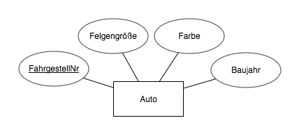

Möchte man für ein Projekt eine Datenbank einsetzen, so lohnt es sich, die Struktur dieser durch ein Modell zu planen.

Eine mögliche Modellierungsart ist das [Entity-Relationship-Modell](https://de.wikipedia.org/wiki/Entity-Relationship-Modell).
Dieses möchte durch eine Abstraktion der zu speichernden Daten in *Entitätsklassen* und *Relationen* einen Überblick über die Struktur der Datenbank verschaffen.

<!--more-->

**Entitätstypen...**  
... stellen eine Abbildung eines Datensatzes dar.
Ein *Entitätstyp* wird im ER-Modell durch einen rechteckigen Kasten gekennzeichnet, in dem sein Name steht.
Mit diesem Kasten sind mehrere ellipsenförmige Attribute verbunden, die diesen Entitätstyp genauer beschreiben.
Beispiel:

Der *Entitätstyp* `Auto` besitzt die vier Attribute FahrgestellNummer, Felgengröße, Farbe sowie Baujahr.
Die FahrgestellNummer ist unterstrichen, da sie ein *Schlüsselattribut*[^1] ist:
Durch sie lässt sich ein Auto eindeutig identifizieren, sie ist *einzigartig*.

[^1]: siehe [Einstieg Datenbanken](https://simonknott.de/articles/EinstiegDB#beispiel)

**Relationen...**  
... stellen eine Beziehung zwischen zwei Entitätstypen dar.
Sie kann verschiedene *Kardinalitäten* besitzen, die wichtigsten sind:

| Kardinalität | Beispiel |
| ------------ | -------- |
| 1:1 | 1 Auto enthält 1 Motor |
| | 1 Motor wird von 1 Auto Enthalten |
| 1:n | 1 Auto wird von n Schlüsseln geöffnet |
| | 1 Schlüssel öffnet 1 Auto |
| n:m | 1 Auto wird von m Fahrern gefahren |
| | 1 Fahrer fährt n Autos |

Eine Kardinalität a:b zwischen zwei Entitäten A sowie B liest sich im folgenden Schema:

"1 A lässt sich in Beziehung setzen zu b B"
"1 B lässt sich in Beziehung setzen zu a A"

Im *Entity-Relationship-Diagramm* wird eine *Relation* durch eine Raute zwischen zwei *Entitäten* gekennzeichnet.
An den Verbindungsstellen stehen die *Kardinalitäten* der Beziehung in Lesrichtung.

Lies:
- 1 Schlüssel öffnet 1 Auto
- 1 Auto wird von n Schlüsseln geöffnet

Man kann sich merken: Die erste Zahl ist immer eine 1, erst die zweite ist von der Relation abhängig.

Auch eine Relation kann selbst Attribute enthalten.

Ein vollsständiges ER-Diagramm aus den einzelnen Beispielen ist am Anfang des Posts zu sehen.
