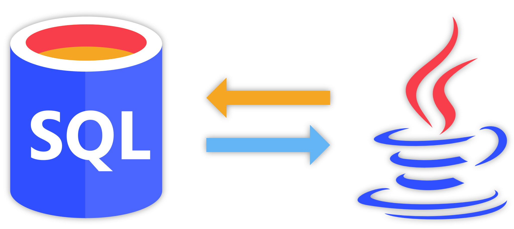

Um von Java aus auf eine Datenbank zuzugreifen, verwendet man die *Java Database Connectivity*-Schnittstelle ([JDBC](http://www.oracle.com/technetwork/java/javase/jdbc/index.html)).
Sie ermöglicht es, über SQL-Statements mit einer Datenbank zu kommunizieren.



<!--more-->

## Wie verwende ich JDBC?

Um JDBC zu benutzen, muss zuerst der entsprechende Datenbank-Treiber für das verwendete RDBMS eingebunden werden.
Für die beliebtesten Datenbanken lassen die sich unter diesen Addressen finden:

- [MySQL](https://dev.mysql.com/downloads/connector/j/)
- [PostGres](https://jdbc.postgresql.org/)
- [SQLite](https://bitbucket.org/xerial/sqlite-jdbc)

Dieser wird dann in der Entwicklungsumgebung oder dem Build-Script als JAR-Bibliothek eingebunden.
Nachdem dies erledigt ist, kann JDBC verwendet werden.

## NRWs DatabaseConnector.java

Das Land NRW stellt seinen Schülern die Klasse `DatabaseConnector` zur Verfügung, die die Arbeit mit JDBC vereinfacht.
Der QuellCode ist [auf Github](https://github.com/Skn0tt/lkDB/blob/master/AbiMotto/src/DatabaseConnector.java) zu sehen.


Möchte man aus einer Datenbank auf dem eigenen Rechner zum Beispiel alle WM-Spiele aus dem Jahre 2014 anzeigen lassen, so sähe der Code so aus:

```java
class WMGames {
  static DatabaseConnector db = new DatabaseConnector("localhost", 3306, "wm", admin, root);

  void gamesOfYear2014() {
    db.executeStatement("SELECT * FROM games WHERE year = 2014;");

    String errorMessage = db.getErrorMessage();
    if (errorMessage != null) {
      System.err.println(errorMessage);
      return;
    }

    QueryResult result = db.getCurrentQueryResult();
  
    // Anzeige des Ergebnisses...
  }
}
```

## Was ist ein QueryResult?

Der DatabaseConnector gibt ein Objekt der Klasse `QueryResult` zurück.
Auch diese ist Teil der NRW-Klassen, sie ist [auf Github](https://github.com/Skn0tt/lkDB/blob/master/AbiMotto/src/QueryResult.java) verfügbar.


Möchte man ein QueryResult zum Beispiel als Text-Tabelle anzeigen, so könnte man folgende Prozedur verwenden:

```java
static String format(QueryResult r) {
  String result = "";

  String[] columNames = r.getColumnNames();
  String headerRow = formatRow(columnNames);
  result += headerRow;
  result += '\n';

  result += '\n';

  for (String[] row : r.getData()) {
    String formattedRow = formatRow(row);
    result += formattedRow;
    result += '\n';
  }

  return result;
}

private static String formatRow(String[] row) {
  String result = "";

  for (String s : row) {
    result += s;
    result += '\t';
  }

  return result;
}
```

Bei der vorher verwendeten Anfrage um die WM-Spiele aus dem Jahr 2014 könnte die Ausgabe so aussehen:

```
TeamA TeamB ScoreA  ScoreB
GER   ARG   1       0
BRA   NLD   0       3
GER   BRA   7       1
...
```

## SQL-Exceptions

Möchte man direkt mit NRWs DatabaseConnector arbeiten, so ist für jede Anfrage viel Boilerplate-Code notwendig:

```java
db.executeStatement("...");

String errorMessage = db.getErrorMessage();
if (errorMessage != null) {
  System.err.println(errorMessage);
  return;
}

return db.getCurrentQueryResult();
```

Wichtig ist davon allerdings nur die erste Zeile.
Um diesen unnötigen Code nicht wiederholen zu müssen, kann man sich einen kleinen Wrapper schreiben:

```java
class DB {
  private static DatabaseConnector db = new DatabaseConnector(...);

  static QueryResult query(String statement) throws SQLException {
    db.executeStatement(statement);

    String errorMessage = db.getErrorMessage();
    if (errorMessage != null) {
      throw new SQLException(errorMessage);
    }

    return db.getCurrentQueryResult();
  }
}
```

Fehler werden so über die idiomatischeren Exceptions verwaltet, die Verwendung sieht wiefolgt aus:

```java
try {
  QueryResult r = DB.query("SELECT * FROM games;");
  // ...
} catch (SQLException e) {
  // Handle Exception
  System.err.println(e.getMessage());
}
```

## TL;DR

JDBC ist eine Schnittstelle zur SQL-Datenbanken.
Um sie zu benutzen, muss ein JDBC-Treiber eingebunden werden, dann kann man aus Java heraus SQL-Statements ausführen und auf den Ergebnisrelationen arbeiten.
