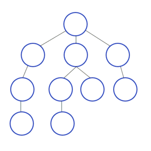

Ein Graph ist toll, um Verbindungen und komplexe Beziehungen zu modellieren.
Wie so ein Graph aussieht und wie man ihn beschreibt, haben wir im [letzten Post](https://simonknott.de/articles/Graphen_Einf%C3%BChrung) gesehen.
Wie man einen Graph durchsucht, erfahren wir heute.


graph {
  scale=0.7
  
  A -- B
  B -- F
  B -- C
  B -- E
  E -- F
  E -- D
  D -- C 
}


<!--more-->

## Breitensuche

Um einen Graphen zu durchsuchen, müssen wir ihn erst einmal durchlaufen, *traversieren* können.

Die Breitensuche geht von einem Knoten aus alle Nachbarknoten ab und durchsucht dann auf die selbe Weise deren Nachbarknoten, bis alle Knoten besucht oder der gesuchte Knoten gefunden wurde.



Hier wird also zuerst *in der Breite* gesucht: Die direkten Nachbarn des aktuellen Knoten werden abgegangen.

## Tiefensuche

Die *Tiefensuche* geht von einem Knoten aus so weit wie möglich in die Tiefe.


Hier wird also zuerst *in der Tiefe* gesucht: Sämtliche Pfade, die man von den Nachbarn aus gehen kann, werden abgegangen.

## Implementierung

Basierend auf der Graphen-Modellierung des Landes NRW kann man hier eine Beispielhafte Implementierung der beiden Traversierungs-Algorithmen sehen.

### Breitensuche

Die Methode `breadthFirstSearch` nimmt einen Graphen, auf dem sie suchen soll, entegegen, außerdem einen Anfangs-Knoten für die Suche und einen End-Knoten, nach dem gesucht wird.
Die Methode gibt zurück, ob der gesuchte Knoten enthalten ist.  

```java
public boolean breadthFirstSearch(Graph graph, Vertex start, Vertex goal) {
  Queue<Vertex> todo = new Queue<>(); // 1
  todo.push(start);                   //

  while (!todo.isEmpty()) {  // 2
    Vertex w = todo.front(); //
    todo.dequeue();          //

    w.setMark(true);        // 3

    List<Vertex> neighborsOfW = graph.getNeighbours(w);                           // 4
    for (neighborsOfW.toFirst(); neighborsOfW.hasAccess(); neighborsOfW.next()) { //
      Vertex u = neighborsOfW.getContent();                                       //

      if (!u.isMarked()) { // 5
        u.setMark(true);   //
        todo.enqueue(u);   //

        if (u == goal) {   // 6
          return true;     //
        }
      }
    }
  }

  return false; // 7
}
```

Der Algorithmus geht wiefolgt vor:
Es wird eine ToDo-Schlange erzeugt, in die alle noch zu durchsuchenden Knoten eingefügt werden.
Zu Beginn ist in dieser nur der Start-Knoten (1).
Nun wird die ToDo-Schlange abgearbeitet (2).
Jeder Knoten `w`, der sich in der Schlange befindet, wird als "besucht" markiert (3).
Dann werden seine Nachbarknoten durchlaufen: wenn ein Knoten noch nicht als "besucht" markiert ist, wird er markiert und in die ToDo-Schlange eingefügt (5).
Ist der Knoten der gesuchte, wird `true` zurückgegeben (6).
Sobald die ToDo-Schlange leer ist, sind alle Knoten durchsucht ohne dass der gesuchte Knoten gefunden wurde.
Dann wird `false` zurückgegeben (7).

### Tiefensuche

```java
public boolean depthFirstSearch(Graph graph, Vertex start, Vertex goal) {
  Stack<Vertex> todo = new Stack<>();
  todo.push(start);

  while (!todo.isEmpty()) {
    Vertex w = todo.top();
    todo.pop();

    w.setMark(true);

    List<Vertex> neighborsOfW = graph.getNeighbours(w);
    for (neighborsOfW.toFirst(); neighborsOfW.hasAccess(); neighborsOfW.next()) {
      Vertex u = neighborsOfW.getContent();

      if (!u.isMarked()) {
        u.setMark(true);
        todo.push(u);

        if (u == goal) {
          return true;
        }
      }
    }
  }

  return false;
}
```

Der Code zur Tiefensuche ist auffällig ähnlich.
Der einzige Unterschied ist, dass die Warte*schlange* nun ein Warte*stapel* ist.
Dies passt zur unterschiedlichen Vorgehensweise der Algorithmen:

Die Breitensuche stellt einen neuen Knoten hintenan und behandelt zuerst die näheren Knoten, die vorne in der Schlange stehen (FIFO).
Die Tiefensuche hingegen behandelt zuerst die neuen Knoten, um somit schnell in die Tiefe zu gehen (LIFO).

## TL;DR

Um einen Graphen zu durchlaufen, kann man die Algorithmen *Breitensuche* und *Tiefensuche* verwenden.
Beide gehen nach dem selben Schema vor:

1. Nimm einen Knoten aus deinem Merkzettel und schaue dir jeden seiner Nachbarknoten an.
2. Falls der Nachbarknoten der gesuchte ist, bist du fertig.
3. Falls der Nachbarknoten bis jetzt unbekannt ist, schreibe ihn auf deinen Merkzettel.

Die Breitensuche nimmt dabei immer den ältesten Wert des Merkzettel, die Tiefensuche den neuesten.

Beide Algorithmen haben die Laufzeit O(v + e), wobei v die Anzahl der Knoten und e die Anzahl der Kanten des Graphen beschreibt.